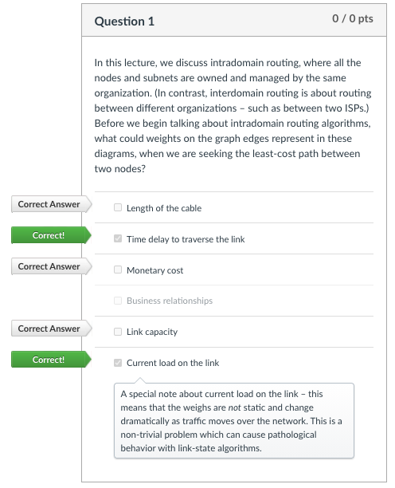
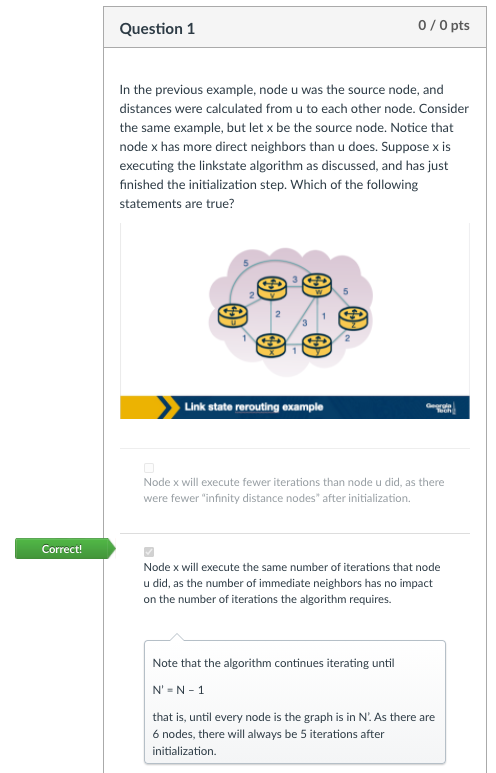

# Intradomain routing

This lesson focuses on routing at the Network Layer within a single domain. It
covers:

* Protocols that determine paths between sources and destinations within a
single domain.
* Link-state and distance-vector algorithms.
* RIP
* OSPF
* Convergence
* Using routing protocols to steer traffic, avoiding congested links.

## Link-state routing algorithm

The **link-state** routing algorithm essentially mimics Dijkstra's algorithm,
representing the network as a graph. `u` is the source node and `v` is every
other node in the network. The cost is represented by `D(v)`, which is the
current least cost path from `u` to node `v`.

The `initialization` step of the algorithm determines all the currently known
least-cost paths from `u` to its adjacent neighbors. Unknown costs for nodes
not directly attached to `u` have a cost of infinity.

The `iterative` step of the algorithm follows a loop that is executed for
every destination node `v` in the network, continuously discovering nodes,
costs, and the overall cost for a path of `u` to `v`.

The algorithm exits by returning the shortest paths and their costs from the
source node to every other node in the network.

The computational complexity of the **link-state** routing algorithm is
**O(n^2)**.

## Distance-vector routing algorithm

The **distance-vector** routing algorithm is:

* iterative
* asynchronous
* distributed
* based on the Bellman Ford Algorithm

Each node maintains its own distance vector with the costs to reach every other
node in the network. Occasionally, the routers will advertise its distance
vector information to adjacent nodes. The adjacent nodes receive that
information, update their own distance vectors, and exchange with other adjacent
nodes.

## Routing Information Protocol (RIP)

Based on the **distance-vector** routing algorithm, each node maintains a RIP
table (Routing Table) which has one row for each subnet in the autonomous
system. RIP version 2 allows subnet entries to be aggregated using route
aggregation techniques.

In RIP, if a router does not hear from its neighbor at least every 180 seconds,
that neighbor is considered to be no longer reachable. The RIP table is modified
and changes are propagated throughout the network. Requests and responses are
sent over UDP, port `520`, layered on top of IP. RIP is actually implemented at
the Application Layer. RIP challenges include:

* Updating routes
* Reducing convergence time
* Avoiding loops / counting to infinity

## Open Shortest Path First (OSPF)

Based on the **link-state** routing algorithm, finds the best path between a
source and destination router. Introduced as an advancement to RIP, uses
flooding of link-state information and a Dijkstra least-cost pathing algorithm.
Advances over RIP include:

* Authentication of messages exchanged between routers
* Options to use multiple same cost paths
* Support for router hierarchy within a domain

### Hierarchy

OSPF autonomous systems can be configured into areas with their own link-state
routing algorithms - border routers are responsible for routing packets outside
of the area (the backbone area).

### Operation

A graph of the autonomous system is constructed, then each node considers itself
the root and computes the shortest path to all subnets, running Dijkstra's
algorithm locally. Link costs are preconfigured by a network administrator.
Whenever a link's state changes, the router broadcasts routing information to
all other routers in the autonomous system.

## Definitions

* **Forwarding** - a the Network Layer, transferring a packet from an incoming
link to an outgoing link within a single router.
* **Routing** - how routers work together using routing protocols to determine
the good paths over which the packets travel from the source to the destination
node.
* **intradomain routing algorithms** - routing within the same adminisrative
domain. Also known as **Interior Gateway Protocols (IGPs)**.
* **forwarding information base** - database used when a data packat arrives at
an interface card of the router, helps the router determine the next hop for the
packet.
* **hot potato routing** - a technique / practice of choosing a path within the
network by choosing the closes egress point based on intradomain path cost.

## Quizzes

## References

1. [Experience in Black-box OSPF Measurement](./pdfs/82.pdf)